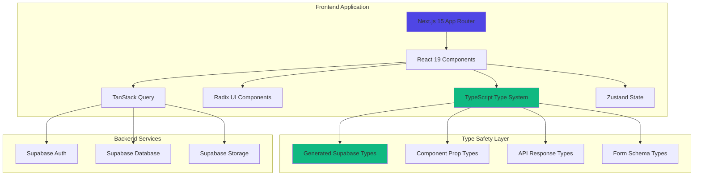
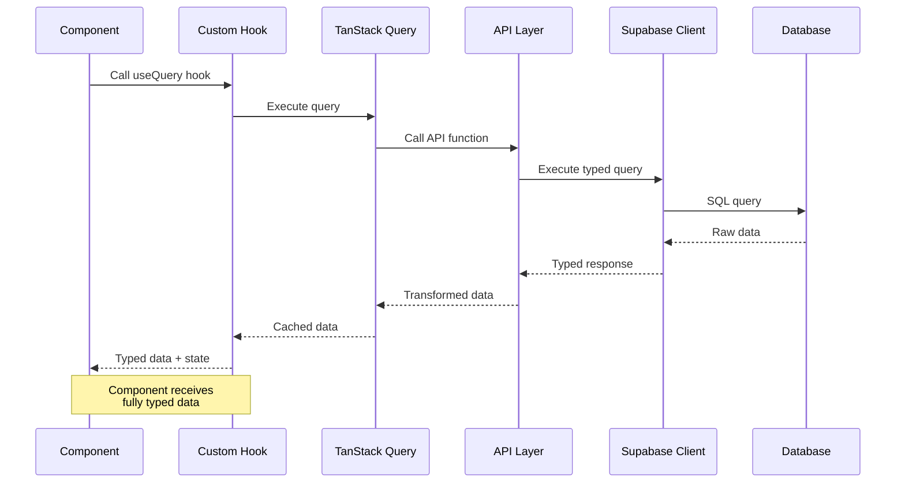

# Design Document: Frontend Modernization with TypeScript

## Overview

This design document outlines the technical approach for modernizing the LMS Kampus frontend application. The modernization addresses critical production issues (Radix UI Slot errors causing 500 errors), migrates the entire codebase from JavaScript to TypeScript, upgrades to Next.js 15 and React 19, and establishes modern development practices.

### Current State Analysis

The existing application has several critical issues:

1. **Radix UI Slot Errors**: Button and Select components incorrectly implement the `asChild` prop pattern, causing runtime errors when Slot receives multiple children
2. **Lack of Type Safety**: JavaScript codebase lacks compile-time validation, leading to runtime errors
3. **Outdated Dependencies**: Next.js 14.1.0 and React 18.2.0 are behind current stable versions
4. **Inconsistent File Extensions**: Mix of .js and .jsx files without clear convention
5. **No Error Boundaries**: Application crashes completely when component errors occur
6. **Limited Testing Infrastructure**: No formal testing setup for unit, component, or E2E tests

### Goals

1. **Eliminate Production Errors**: Fix Radix UI Slot composition issues immediately
2. **Achieve Type Safety**: Migrate entire codebase to TypeScript with strict mode
3. **Modernize Stack**: Upgrade to Next.js 15 and React 19
4. **Improve Developer Experience**: Establish clear conventions, tooling, and documentation
5. **Maintain Backward Compatibility**: Ensure existing Supabase backend continues working without changes
6. **Establish Testing Foundation**: Implement comprehensive testing infrastructure

### Success Criteria

- Zero TypeScript compilation errors
- Zero runtime Slot composition errors
- All pages render successfully in production
- Build time under 60 seconds for production builds
- First Contentful Paint under 1.5 seconds
- 100% backward compatibility with existing Supabase backend

## Architecture

### Migration Strategy Decision

**Recommendation: Incremental Migration Approach**

After analyzing the codebase structure and requirements, an incremental migration is the optimal strategy.

#### Rationale

**Pros of Incremental Approach:**
- Lower risk: Changes can be tested and validated incrementally
- Continuous deployment: Features remain available throughout migration
- Easier rollback: Individual changes can be reverted if issues arise
- Team productivity: Developers can continue feature work during migration
- Learning curve: Team learns TypeScript patterns gradually
- Critical fixes first: Radix UI Slot errors can be fixed immediately

**Cons of Incremental Approach:**
- Longer timeline: Migration happens over multiple phases
- Temporary inconsistency: Mix of .js and .ts files during transition
- Coordination overhead: Need to track migration progress

**Pros of Full Rewrite:**
- Clean slate: Opportunity to restructure everything optimally
- Consistency: All files follow same patterns from day one
- Faster completion: All changes happen at once

**Cons of Full Rewrite:**
- High risk: Large changes increase chance of introducing bugs
- Extended downtime: Features unavailable during rewrite
- Difficult rollback: Hard to revert if major issues discovered
- Resource intensive: Requires full team focus for extended period
- Testing burden: Everything must be retested simultaneously

**Decision**: Incremental migration minimizes risk while allowing critical fixes (Radix UI Slot errors) to be deployed immediately. The existing app router structure and component organization are sound, requiring refinement rather than complete restructuring.

### Migration Phases

#### Phase 1: Critical Fixes and Foundation (Week 1)
**Priority: CRITICAL - Fixes production errors**

1. Fix Radix UI Slot composition errors in Button component
2. Fix Radix UI Slot composition errors in Select component
3. Upgrade Next.js to 15.x and React to 19.x
4. Add TypeScript dependencies and create tsconfig.json
5. Implement root-level error boundary
6. Deploy to production

**Deliverables:**
- Zero Slot composition errors
- Production stability restored
- TypeScript configuration ready

#### Phase 2: Core Infrastructure Migration (Week 2)
**Priority: HIGH - Enables type safety**

1. Generate Supabase TypeScript types
2. Migrate utility functions (lib/utils.js → lib/utils.ts)
3. Migrate Supabase client files to TypeScript
4. Create type definitions for common patterns
5. Migrate UI components to TypeScript (.jsx → .tsx)
6. Update path aliases in tsconfig.json

**Deliverables:**
- Type-safe Supabase client
- All UI components in TypeScript
- Shared type definitions available

#### Phase 3: Page Migration (Week 3-4)
**Priority: MEDIUM - Completes type safety**

1. Migrate authentication pages ((auth) route group)
2. Migrate student pages ((student) route group)
3. Migrate instructor pages ((instructor) route group)
4. Migrate admin pages ((admin) route group)
5. Migrate public pages (courses, home)
6. Remove jsconfig.json

**Deliverables:**
- All pages in TypeScript
- Zero .js/.jsx files in source
- Full type safety across application

#### Phase 4: Testing and Optimization (Week 5)
**Priority: MEDIUM - Ensures quality**

1. Set up Vitest for unit testing
2. Set up React Testing Library for component testing
3. Set up Playwright for E2E testing
4. Write example tests for each testing type
5. Implement code splitting optimizations
6. Add performance monitoring

**Deliverables:**
- Complete testing infrastructure
- Example tests for reference
- Performance baseline established

### High-Level Architecture Diagram



### Error Handling Architecture

```mermaid
graph TD
    A[Root Error Boundary] --> B[Route Group Error Boundaries]
    B --> C[(auth) Error Boundary]
    B --> D[(student) Error Boundary]
    B --> E[(instructor) Error Boundary]
    B --> F[(admin) Error Boundary]
    
    C --> G[Auth Pages]
    D --> H[Student Pages]
    E --> I[Instructor Pages]
    F --> J[Admin Pages]
    
    A --> K[Error Logger]
    K --> L[Console/Monitoring Service]
    
    style A fill:#ef4444
    style K fill:#f59e0b
```

## Components and Interfaces

### Radix UI Slot Pattern Fix

The current Button and Select components have critical Slot composition errors. The issue occurs when `asChild={true}` is used with components that have multiple children.

#### Problem Analysis

**Current Button Implementation Issue:**
```typescript
// INCORRECT - Causes error when asChild=true and loading=true
const Comp = asChild ? Slot : "button"
return (
  <Comp>
    {loading && <Spinner />}  // First child
    {children}                 // Second child - ERROR: Slot expects single child
  </Comp>
)
```

**Root Cause**: Radix UI Slot component uses React.cloneElement internally and expects exactly one child. When we add a loading spinner alongside children, Slot receives multiple children and throws an error.

#### Solution Design

**Fixed Button Implementation:**
```typescript
const Button = React.forwardRef<HTMLButtonElement, ButtonProps>(
  ({ className, variant = "primary", size = "default", asChild = false, disabled, loading, children, ...props }, ref) => {
    const Comp = asChild ? Slot : "button"
    
    // When asChild is true, we cannot add loading spinner as it creates multiple children
    // The parent component using asChild must handle loading state
    if (asChild) {
      return (
        <Comp
          className={cn(buttonVariants({ variant, size, className }))}
          ref={ref}
          {...props}
        >
          {children}
        </Comp>
      )
    }
    
    // When asChild is false, we can safely add loading spinner
    return (
      <Comp
        className={cn(buttonVariants({ variant, size, className }))}
        ref={ref}
        disabled={disabled || loading}
        {...props}
      >
        {loading && (
          <svg className="animate-spin -ml-1 mr-2 h-4 w-4" xmlns="http://www.w3.org/2000/svg" fill="none" viewBox="0 0 24 24">
            <circle className="opacity-25" cx="12" cy="12" r="10" stroke="currentColor" strokeWidth="4"></circle>
            <path className="opacity-75" fill="currentColor" d="M4 12a8 8 0 018-8V0C5.373 0 0 5.373 0 12h4zm2 5.291A7.962 7.962 0 014 12H0c0 3.042 1.135 5.824 3 7.938l3-2.647z"></path>
          </svg>
        )}
        {children}
      </Comp>
    )
  }
)
```

**Key Design Decisions:**
1. **Early Return Pattern**: Separate code paths for `asChild={true}` and `asChild={false}`
2. **Loading State Limitation**: When `asChild={true}`, loading prop is ignored (documented in JSDoc)
3. **Single Child Guarantee**: asChild path only renders `{children}`, ensuring Slot receives exactly one child
4. **Parent Responsibility**: Components using `asChild` must handle their own loading states

#### Component Composition Patterns

**Pattern 1: Direct Button Usage (No asChild)**
```typescript
// Safe - Button handles loading internally
<Button loading={isLoading}>
  Submit
</Button>
```

**Pattern 2: Button as Link (With asChild)**
```typescript
// Safe - Single child passed to Slot
<Button asChild>
  <Link href="/dashboard">Go to Dashboard</Link>
</Button>

// UNSAFE - Would cause error if loading prop was respected
<Button asChild loading={true}>  // loading is ignored when asChild=true
  <Link href="/dashboard">Go to Dashboard</Link>
</Button>
```

**Pattern 3: Custom Component Wrapper**
```typescript
// Safe - Parent handles loading state
<Button asChild>
  <CustomLink loading={isLoading}>
    {isLoading ? 'Loading...' : 'Submit'}
  </CustomLink>
</Button>
```

### TypeScript Component Interfaces

#### Button Component Types

```typescript
import * as React from "react"
import { Slot } from "@radix-ui/react-slot"
import { type VariantProps } from "class-variance-authority"

export interface ButtonProps
  extends React.ButtonHTMLAttributes<HTMLButtonElement>,
    VariantProps<typeof buttonVariants> {
  /**
   * If true, the button will render as a Slot component, allowing you to pass a custom element as a child.
   * When asChild is true, the loading prop is ignored as Slot requires a single child.
   * The parent component must handle loading states when using asChild.
   */
  asChild?: boolean
  /**
   * If true, shows a loading spinner and disables the button.
   * Only works when asChild is false.
   */
  loading?: boolean
}
```

#### Select Component Types

```typescript
import * as React from "react"
import * as SelectPrimitive from "@radix-ui/react-select"

export interface SelectTriggerProps
  extends React.ComponentPropsWithoutRef<typeof SelectPrimitive.Trigger> {}

export interface SelectContentProps
  extends React.ComponentPropsWithoutRef<typeof SelectPrimitive.Content> {
  position?: "popper" | "item-aligned"
}

export interface SelectItemProps
  extends React.ComponentPropsWithoutRef<typeof SelectPrimitive.Item> {}

export interface SelectLabelProps
  extends React.ComponentPropsWithoutRef<typeof SelectPrimitive.Label> {}
```

#### Common Component Patterns

```typescript
// Pattern 1: Component with children
export interface CardProps extends React.HTMLAttributes<HTMLDivElement> {
  children: React.ReactNode
}

// Pattern 2: Component with optional children
export interface BadgeProps extends React.HTMLAttributes<HTMLDivElement> {
  children?: React.ReactNode
  variant?: "default" | "success" | "warning" | "danger"
}

// Pattern 3: Component with render prop
export interface EmptyStateProps {
  title: string
  description?: string
  action?: React.ReactNode
  icon?: React.ComponentType<{ className?: string }>
}

// Pattern 4: Generic component
export interface DataTableProps<TData> {
  data: TData[]
  columns: ColumnDef<TData>[]
  onRowClick?: (row: TData) => void
}
```

### Supabase Type Integration

#### Generated Database Types

```typescript
// lib/database.types.ts (generated via supabase gen types)
export type Json =
  | string
  | number
  | boolean
  | null
  | { [key: string]: Json | undefined }
  | Json[]

export interface Database {
  public: {
    Tables: {
      users: {
        Row: {
          id: string
          email: string
          full_name: string | null
          role: 'student' | 'instructor' | 'admin'
          created_at: string
          updated_at: string
        }
        Insert: {
          id?: string
          email: string
          full_name?: string | null
          role?: 'student' | 'instructor' | 'admin'
          created_at?: string
          updated_at?: string
        }
        Update: {
          id?: string
          email?: string
          full_name?: string | null
          role?: 'student' | 'instructor' | 'admin'
          created_at?: string
          updated_at?: string
        }
      }
      courses: {
        Row: {
          id: string
          title: string
          slug: string
          description: string | null
          instructor_id: string
          thumbnail_url: string | null
          price: number
          is_published: boolean
          created_at: string
          updated_at: string
        }
        Insert: {
          id?: string
          title: string
          slug: string
          description?: string | null
          instructor_id: string
          thumbnail_url?: string | null
          price?: number
          is_published?: boolean
          created_at?: string
          updated_at?: string
        }
        Update: {
          id?: string
          title?: string
          slug?: string
          description?: string | null
          instructor_id?: string
          thumbnail_url?: string | null
          price?: number
          is_published?: boolean
          created_at?: string
          updated_at?: string
        }
      }
      // ... other tables
    }
    Views: {
      [_ in never]: never
    }
    Functions: {
      [_ in never]: never
    }
    Enums: {
      user_role: 'student' | 'instructor' | 'admin'
    }
  }
}
```

#### Type-Safe Supabase Client

```typescript
// lib/supabase/client.ts
import { createBrowserClient } from '@supabase/ssr'
import type { Database } from '@/lib/database.types'

export function createClient() {
  return createBrowserClient<Database>(
    process.env.NEXT_PUBLIC_SUPABASE_URL!,
    process.env.NEXT_PUBLIC_SUPABASE_ANON_KEY!
  )
}

// Usage provides full type safety
const supabase = createClient()
const { data, error } = await supabase
  .from('courses')  // ✓ Type-checked table name
  .select('title, instructor_id')  // ✓ Type-checked column names
  .eq('is_published', true)  // ✓ Type-checked column and value

// data is typed as: { title: string; instructor_id: string }[] | null
```

#### API Layer Types

```typescript
// types/api.ts
import type { Database } from '@/lib/database.types'

// Helper type to extract table row types
export type Tables<T extends keyof Database['public']['Tables']> =
  Database['public']['Tables'][T]['Row']

export type Course = Tables<'courses'>
export type User = Tables<'users'>
export type Enrollment = Tables<'enrollments'>

// API response wrapper types
export interface ApiResponse<T> {
  data: T | null
  error: ApiError | null
}

export interface ApiError {
  message: string
  code?: string
  details?: unknown
}

// Pagination types
export interface PaginatedResponse<T> {
  data: T[]
  count: number
  page: number
  pageSize: number
}

// Query parameter types
export interface CourseFilters {
  category?: string
  instructor_id?: string
  is_published?: boolean
  search?: string
}
```

## Data Models

### Core Domain Models

#### User Model

```typescript
// types/models/user.ts
import type { Tables } from '@/types/api'

export type UserRole = 'student' | 'instructor' | 'admin'

export interface User extends Tables<'users'> {
  // Database fields are inherited
  // Add computed or derived fields here
}

export interface UserProfile extends User {
  enrollmentCount?: number
  coursesCreated?: number
}

export interface AuthUser {
  id: string
  email: string
  role: UserRole
  full_name: string | null
}
```

#### Course Model

```typescript
// types/models/course.ts
import type { Tables } from '@/types/api'

export interface Course extends Tables<'courses'> {
  // Database fields inherited
}

export interface CourseWithInstructor extends Course {
  instructor: {
    id: string
    full_name: string | null
    email: string
  }
}

export interface CourseWithStats extends Course {
  enrollmentCount: number
  averageRating: number | null
  totalLessons: number
  totalDuration: number
}

export interface CourseFormData {
  title: string
  slug: string
  description: string
  price: number
  thumbnail_url?: string
  is_published: boolean
}
```

#### Enrollment Model

```typescript
// types/models/enrollment.ts
import type { Tables } from '@/types/api'

export interface Enrollment extends Tables<'enrollments'> {
  // Database fields inherited
}

export interface EnrollmentWithCourse extends Enrollment {
  course: {
    id: string
    title: string
    slug: string
    thumbnail_url: string | null
  }
}

export interface EnrollmentProgress {
  enrollment_id: string
  completed_lessons: number
  total_lessons: number
  progress_percentage: number
  last_accessed_at: string | null
}
```

### Form Data Models

```typescript
// types/forms.ts
import { z } from 'zod'

// Login form
export const loginSchema = z.object({
  email: z.string().email('Email tidak valid'),
  password: z.string().min(6, 'Password minimal 6 karakter'),
})

export type LoginFormData = z.infer<typeof loginSchema>

// Register form
export const registerSchema = z.object({
  email: z.string().email('Email tidak valid'),
  password: z.string().min(6, 'Password minimal 6 karakter'),
  full_name: z.string().min(2, 'Nama minimal 2 karakter'),
  role: z.enum(['student', 'instructor']),
})

export type RegisterFormData = z.infer<typeof registerSchema>

// Course creation form
export const courseSchema = z.object({
  title: z.string().min(3, 'Judul minimal 3 karakter'),
  slug: z.string().min(3, 'Slug minimal 3 karakter').regex(/^[a-z0-9-]+$/, 'Slug hanya boleh huruf kecil, angka, dan dash'),
  description: z.string().min(10, 'Deskripsi minimal 10 karakter'),
  price: z.number().min(0, 'Harga tidak boleh negatif'),
  thumbnail_url: z.string().url('URL tidak valid').optional().or(z.literal('')),
  is_published: z.boolean(),
})

export type CourseFormData = z.infer<typeof courseSchema>
```

### State Management Models

```typescript
// types/store.ts

// Auth store
export interface AuthState {
  user: AuthUser | null
  isLoading: boolean
  isAuthenticated: boolean
}

export interface AuthActions {
  setUser: (user: AuthUser | null) => void
  setLoading: (isLoading: boolean) => void
  logout: () => void
}

export type AuthStore = AuthState & AuthActions

// UI store
export interface UIState {
  sidebarOpen: boolean
  theme: 'light' | 'dark' | 'system'
}

export interface UIActions {
  toggleSidebar: () => void
  setSidebarOpen: (open: boolean) => void
  setTheme: (theme: 'light' | 'dark' | 'system') => void
}

export type UIStore = UIState & UIActions
```

## Data Flow Architecture




## TypeScript Configuration

### tsconfig.json

```json
{
  "compilerOptions": {
    // Language and Environment
    "target": "ES2022",
    "lib": ["ES2022", "DOM", "DOM.Iterable"],
    "jsx": "preserve",
    
    // Modules
    "module": "esnext",
    "moduleResolution": "bundler",
    "resolveJsonModule": true,
    
    // Emit
    "noEmit": true,
    "incremental": true,
    
    // Interop Constraints
    "esModuleInterop": true,
    "allowSyntheticDefaultImports": true,
    "forceConsistentCasingInFileNames": true,
    "isolatedModules": true,
    
    // Type Checking - STRICT MODE
    "strict": true,
    "noUncheckedIndexedAccess": true,
    "noImplicitAny": true,
    "strictNullChecks": true,
    "strictFunctionTypes": true,
    "strictBindCallApply": true,
    "strictPropertyInitialization": true,
    "noImplicitThis": true,
    "alwaysStrict": true,
    "noUnusedLocals": true,
    "noUnusedParameters": true,
    "noImplicitReturns": true,
    "noFallthroughCasesInSwitch": true,
    "noUncheckedSideEffectImports": true,
    
    // Completeness
    "skipLibCheck": true,
    
    // Path Aliases
    "baseUrl": ".",
    "paths": {
      "@/*": ["./*"],
      "@/components/*": ["./components/*"],
      "@/lib/*": ["./lib/*"],
      "@/types/*": ["./types/*"],
      "@/hooks/*": ["./hooks/*"],
      "@/app/*": ["./app/*"]
    },
    
    // Next.js specific
    "plugins": [
      {
        "name": "next"
      }
    ]
  },
  "include": [
    "next-env.d.ts",
    "**/*.ts",
    "**/*.tsx",
    ".next/types/**/*.ts"
  ],
  "exclude": [
    "node_modules",
    ".next",
    "out"
  ]
}
```

### Key Configuration Decisions

**Strict Mode Enabled**: All strict type checking options are enabled to catch potential bugs at compile time. This includes:
- `noUncheckedIndexedAccess`: Prevents accessing array/object properties without checking if they exist
- `noImplicitAny`: Requires explicit type annotations, preventing accidental `any` types
- `strictNullChecks`: Requires explicit handling of null/undefined values

**Module Resolution**: Using `bundler` mode for optimal Next.js 15 compatibility and modern import resolution.

**Path Aliases**: Configured for clean imports throughout the application:
```typescript
// Instead of: import { Button } from '../../../components/ui/button'
// Use: import { Button } from '@/components/ui/button'
```

### Type Declaration Files

#### Global Type Declarations

```typescript
// types/global.d.ts
import type { Database } from '@/lib/database.types'

declare global {
  namespace NodeJS {
    interface ProcessEnv {
      NEXT_PUBLIC_SUPABASE_URL: string
      NEXT_PUBLIC_SUPABASE_ANON_KEY: string
      SUPABASE_SERVICE_ROLE_KEY: string
      NODE_ENV: 'development' | 'production' | 'test'
    }
  }
}

export {}
```

#### Next.js Type Augmentation

```typescript
// types/next.d.ts
import type { Database } from '@/lib/database.types'
import type { SupabaseClient } from '@supabase/supabase-js'

declare module 'next' {
  interface PageProps {
    params: Promise<Record<string, string>>
    searchParams: Promise<Record<string, string | string[] | undefined>>
  }
}
```

#### Utility Types

```typescript
// types/utils.ts

// Make all properties optional recursively
export type DeepPartial<T> = {
  [P in keyof T]?: T[P] extends object ? DeepPartial<T[P]> : T[P]
}

// Make specific properties required
export type RequireFields<T, K extends keyof T> = T & Required<Pick<T, K>>

// Make specific properties optional
export type OptionalFields<T, K extends keyof T> = Omit<T, K> & Partial<Pick<T, K>>

// Extract promise type
export type Awaited<T> = T extends Promise<infer U> ? U : T

// Extract array element type
export type ArrayElement<T> = T extends (infer U)[] ? U : never

// Nullable type
export type Nullable<T> = T | null

// Make all properties nullable
export type DeepNullable<T> = {
  [P in keyof T]: T[P] extends object ? DeepNullable<T[P]> : T[P] | null
}
```

## Error Handling

### Error Boundary Implementation

#### Root Error Boundary

```typescript
// app/error.tsx
'use client'

import { useEffect } from 'react'
import { Button } from '@/components/ui/button'

export default function Error({
  error,
  reset,
}: {
  error: Error & { digest?: string }
  reset: () => void
}) {
  useEffect(() => {
    // Log error to monitoring service
    console.error('Application error:', error)
    
    // TODO: Send to error monitoring service (e.g., Sentry)
    // logErrorToService(error)
  }, [error])

  return (
    <div className="flex min-h-screen flex-col items-center justify-center p-4">
      <div className="max-w-md text-center">
        <h1 className="text-4xl font-bold text-ink-900 mb-4">
          Terjadi Kesalahan
        </h1>
        <p className="text-ink-600 mb-6">
          Maaf, terjadi kesalahan yang tidak terduga. Tim kami telah diberitahu dan sedang menangani masalah ini.
        </p>
        {error.digest && (
          <p className="text-sm text-ink-400 mb-6">
            Error ID: {error.digest}
          </p>
        )}
        <div className="flex gap-4 justify-center">
          <Button onClick={reset}>
            Coba Lagi
          </Button>
          <Button variant="ghost" asChild>
            <a href="/">Kembali ke Beranda</a>
          </Button>
        </div>
      </div>
    </div>
  )
}
```

#### Route Group Error Boundaries

```typescript
// app/(student)/error.tsx
'use client'

import { useEffect } from 'react'
import { Button } from '@/components/ui/button'
import { useRouter } from 'next/navigation'

export default function StudentError({
  error,
  reset,
}: {
  error: Error & { digest?: string }
  reset: () => void
}) {
  const router = useRouter()

  useEffect(() => {
    console.error('Student area error:', error)
  }, [error])

  return (
    <div className="flex min-h-[60vh] flex-col items-center justify-center p-4">
      <div className="max-w-md text-center">
        <h2 className="text-2xl font-bold text-ink-900 mb-4">
          Terjadi Kesalahan di Area Siswa
        </h2>
        <p className="text-ink-600 mb-6">
          Maaf, terjadi kesalahan saat memuat halaman ini.
        </p>
        <div className="flex gap-4 justify-center">
          <Button onClick={reset}>
            Coba Lagi
          </Button>
          <Button variant="ghost" onClick={() => router.push('/student')}>
            Kembali ke Dashboard
          </Button>
        </div>
      </div>
    </div>
  )
}
```

### Error Logging Strategy

```typescript
// lib/error-logger.ts
export interface ErrorLog {
  message: string
  stack?: string
  digest?: string
  timestamp: string
  userAgent: string
  url: string
  userId?: string
}

export function logError(error: Error, context?: Record<string, unknown>): void {
  const errorLog: ErrorLog = {
    message: error.message,
    stack: error.stack,
    digest: (error as Error & { digest?: string }).digest,
    timestamp: new Date().toISOString(),
    userAgent: typeof window !== 'undefined' ? window.navigator.userAgent : 'server',
    url: typeof window !== 'undefined' ? window.location.href : 'server',
    ...context,
  }

  // Log to console in development
  if (process.env.NODE_ENV === 'development') {
    console.error('Error logged:', errorLog)
  }

  // TODO: Send to monitoring service in production
  // if (process.env.NODE_ENV === 'production') {
  //   sendToSentry(errorLog)
  // }
}
```

### API Error Handling

```typescript
// lib/api-error.ts
export class ApiError extends Error {
  constructor(
    message: string,
    public statusCode: number,
    public code?: string,
    public details?: unknown
  ) {
    super(message)
    this.name = 'ApiError'
  }

  static fromSupabaseError(error: unknown): ApiError {
    if (error && typeof error === 'object' && 'message' in error) {
      return new ApiError(
        error.message as string,
        'code' in error ? Number(error.code) : 500,
        'code' in error ? String(error.code) : undefined,
        error
      )
    }
    return new ApiError('An unknown error occurred', 500)
  }

  toJSON() {
    return {
      message: this.message,
      statusCode: this.statusCode,
      code: this.code,
      details: this.details,
    }
  }
}

// Usage in API functions
export async function getCourse(id: string): Promise<Course> {
  const supabase = createClient()
  const { data, error } = await supabase
    .from('courses')
    .select('*')
    .eq('id', id)
    .single()

  if (error) {
    throw ApiError.fromSupabaseError(error)
  }

  if (!data) {
    throw new ApiError('Course not found', 404, 'COURSE_NOT_FOUND')
  }

  return data
}
```

### User-Facing Error Messages

```typescript
// lib/error-messages.ts
export const ERROR_MESSAGES = {
  // Authentication errors
  AUTH_INVALID_CREDENTIALS: 'Email atau password salah',
  AUTH_USER_NOT_FOUND: 'Pengguna tidak ditemukan',
  AUTH_EMAIL_ALREADY_EXISTS: 'Email sudah terdaftar',
  AUTH_WEAK_PASSWORD: 'Password terlalu lemah',
  AUTH_SESSION_EXPIRED: 'Sesi Anda telah berakhir, silakan login kembali',
  
  // Course errors
  COURSE_NOT_FOUND: 'Kursus tidak ditemukan',
  COURSE_ALREADY_ENROLLED: 'Anda sudah terdaftar di kursus ini',
  COURSE_NOT_PUBLISHED: 'Kursus ini belum dipublikasikan',
  
  // Permission errors
  PERMISSION_DENIED: 'Anda tidak memiliki izin untuk mengakses halaman ini',
  INSTRUCTOR_ONLY: 'Halaman ini hanya untuk instruktur',
  ADMIN_ONLY: 'Halaman ini hanya untuk admin',
  
  // Network errors
  NETWORK_ERROR: 'Terjadi kesalahan jaringan, silakan coba lagi',
  SERVER_ERROR: 'Terjadi kesalahan server, silakan coba lagi nanti',
  
  // Generic errors
  UNKNOWN_ERROR: 'Terjadi kesalahan yang tidak terduga',
  VALIDATION_ERROR: 'Data yang Anda masukkan tidak valid',
} as const

export type ErrorCode = keyof typeof ERROR_MESSAGES

export function getErrorMessage(code: ErrorCode | string): string {
  if (code in ERROR_MESSAGES) {
    return ERROR_MESSAGES[code as ErrorCode]
  }
  return ERROR_MESSAGES.UNKNOWN_ERROR
}
```

## Testing Strategy

### Testing Infrastructure Setup

#### Vitest Configuration

```typescript
// vitest.config.ts
import { defineConfig } from 'vitest/config'
import react from '@vitejs/plugin-react'
import path from 'path'

export default defineConfig({
  plugins: [react()],
  test: {
    environment: 'jsdom',
    globals: true,
    setupFiles: ['./vitest.setup.ts'],
    coverage: {
      provider: 'v8',
      reporter: ['text', 'json', 'html'],
      exclude: [
        'node_modules/',
        '.next/',
        'vitest.config.ts',
        '**/*.d.ts',
        '**/*.config.ts',
        '**/types/**',
      ],
    },
  },
  resolve: {
    alias: {
      '@': path.resolve(__dirname, './'),
    },
  },
})
```

```typescript
// vitest.setup.ts
import '@testing-library/jest-dom'
import { cleanup } from '@testing-library/react'
import { afterEach } from 'vitest'

// Cleanup after each test
afterEach(() => {
  cleanup()
})

// Mock Next.js router
vi.mock('next/navigation', () => ({
  useRouter: () => ({
    push: vi.fn(),
    replace: vi.fn(),
    prefetch: vi.fn(),
    back: vi.fn(),
  }),
  usePathname: () => '/',
  useSearchParams: () => new URLSearchParams(),
}))
```

#### Playwright Configuration

```typescript
// playwright.config.ts
import { defineConfig, devices } from '@playwright/test'

export default defineConfig({
  testDir: './e2e',
  fullyParallel: true,
  forbidOnly: !!process.env.CI,
  retries: process.env.CI ? 2 : 0,
  workers: process.env.CI ? 1 : undefined,
  reporter: 'html',
  use: {
    baseURL: 'http://localhost:3000',
    trace: 'on-first-retry',
    screenshot: 'only-on-failure',
  },
  projects: [
    {
      name: 'chromium',
      use: { ...devices['Desktop Chrome'] },
    },
    {
      name: 'firefox',
      use: { ...devices['Desktop Firefox'] },
    },
    {
      name: 'webkit',
      use: { ...devices['Desktop Safari'] },
    },
  ],
  webServer: {
    command: 'npm run dev',
    url: 'http://localhost:3000',
    reuseExistingServer: !process.env.CI,
  },
})
```

### Unit Testing Patterns

#### Testing Utility Functions

```typescript
// lib/__tests__/utils.test.ts
import { describe, it, expect } from 'vitest'
import { cn, formatDate, formatDuration } from '../utils'

describe('cn utility', () => {
  it('should merge class names correctly', () => {
    expect(cn('px-4', 'py-2')).toBe('px-4 py-2')
  })

  it('should handle conditional classes', () => {
    expect(cn('base', false && 'hidden', 'visible')).toBe('base visible')
  })

  it('should merge Tailwind classes correctly', () => {
    expect(cn('px-4', 'px-6')).toBe('px-6')
  })
})

describe('formatDate', () => {
  it('should format date in Indonesian locale', () => {
    const date = new Date('2024-01-15')
    expect(formatDate(date)).toMatch(/15 Januari 2024/)
  })
})

describe('formatDuration', () => {
  it('should format minutes only', () => {
    expect(formatDuration(300)).toBe('5 menit')
  })

  it('should format hours and minutes', () => {
    expect(formatDuration(3900)).toBe('1j 5m')
  })
})
```

#### Testing API Functions

```typescript
// lib/api/__tests__/courses.test.ts
import { describe, it, expect, vi, beforeEach } from 'vitest'
import { getCourse, getCourses } from '../courses'
import { createClient } from '@/lib/supabase/client'

vi.mock('@/lib/supabase/client')

describe('getCourse', () => {
  beforeEach(() => {
    vi.clearAllMocks()
  })

  it('should return course when found', async () => {
    const mockCourse = {
      id: '1',
      title: 'Test Course',
      slug: 'test-course',
      description: 'Test description',
      instructor_id: 'instructor-1',
      price: 100000,
      is_published: true,
      created_at: '2024-01-01',
      updated_at: '2024-01-01',
    }

    vi.mocked(createClient).mockReturnValue({
      from: vi.fn().mockReturnValue({
        select: vi.fn().mockReturnValue({
          eq: vi.fn().mockReturnValue({
            single: vi.fn().mockResolvedValue({
              data: mockCourse,
              error: null,
            }),
          }),
        }),
      }),
    } as any)

    const result = await getCourse('1')
    expect(result).toEqual(mockCourse)
  })

  it('should throw error when course not found', async () => {
    vi.mocked(createClient).mockReturnValue({
      from: vi.fn().mockReturnValue({
        select: vi.fn().mockReturnValue({
          eq: vi.fn().mockReturnValue({
            single: vi.fn().mockResolvedValue({
              data: null,
              error: { message: 'Not found' },
            }),
          }),
        }),
      }),
    } as any)

    await expect(getCourse('999')).rejects.toThrow()
  })
})
```

### Component Testing Patterns

#### Testing UI Components

```typescript
// components/ui/__tests__/button.test.tsx
import { describe, it, expect, vi } from 'vitest'
import { render, screen } from '@testing-library/react'
import userEvent from '@testing-library/user-event'
import { Button } from '../button'

describe('Button', () => {
  it('should render children correctly', () => {
    render(<Button>Click me</Button>)
    expect(screen.getByRole('button', { name: 'Click me' })).toBeInTheDocument()
  })

  it('should handle click events', async () => {
    const handleClick = vi.fn()
    render(<Button onClick={handleClick}>Click me</Button>)
    
    await userEvent.click(screen.getByRole('button'))
    expect(handleClick).toHaveBeenCalledTimes(1)
  })

  it('should show loading spinner when loading', () => {
    render(<Button loading>Submit</Button>)
    expect(screen.getByRole('button')).toBeDisabled()
    expect(screen.getByRole('button')).toHaveClass('disabled:opacity-70')
  })

  it('should not show loading spinner when asChild is true', () => {
    render(
      <Button asChild loading>
        <a href="/test">Link</a>
      </Button>
    )
    // Loading spinner should not be rendered
    expect(screen.queryByRole('img')).not.toBeInTheDocument()
  })

  it('should apply variant classes correctly', () => {
    const { rerender } = render(<Button variant="primary">Primary</Button>)
    expect(screen.getByRole('button')).toHaveClass('bg-brand-500')

    rerender(<Button variant="ghost">Ghost</Button>)
    expect(screen.getByRole('button')).toHaveClass('bg-transparent')
  })
})
```

#### Testing Page Components

```typescript
// app/(student)/student/__tests__/page.test.tsx
import { describe, it, expect, vi } from 'vitest'
import { render, screen, waitFor } from '@testing-library/react'
import StudentDashboard from '../page'

vi.mock('@/lib/supabase/client')

describe('StudentDashboard', () => {
  it('should render loading state initially', () => {
    render(<StudentDashboard />)
    expect(screen.getByText(/loading/i)).toBeInTheDocument()
  })

  it('should render enrolled courses', async () => {
    // Mock API response
    vi.mocked(createClient).mockReturnValue({
      from: vi.fn().mockReturnValue({
        select: vi.fn().mockResolvedValue({
          data: [
            { id: '1', title: 'Course 1' },
            { id: '2', title: 'Course 2' },
          ],
          error: null,
        }),
      }),
    } as any)

    render(<StudentDashboard />)

    await waitFor(() => {
      expect(screen.getByText('Course 1')).toBeInTheDocument()
      expect(screen.getByText('Course 2')).toBeInTheDocument()
    })
  })

  it('should show empty state when no courses', async () => {
    vi.mocked(createClient).mockReturnValue({
      from: vi.fn().mockReturnValue({
        select: vi.fn().mockResolvedValue({
          data: [],
          error: null,
        }),
      }),
    } as any)

    render(<StudentDashboard />)

    await waitFor(() => {
      expect(screen.getByText(/belum ada kursus/i)).toBeInTheDocument()
    })
  })
})
```

### E2E Testing Patterns

#### Authentication Flow Test

```typescript
// e2e/auth.spec.ts
import { test, expect } from '@playwright/test'

test.describe('Authentication', () => {
  test('should login successfully with valid credentials', async ({ page }) => {
    await page.goto('/login')

    await page.fill('input[name="email"]', 'student@test.com')
    await page.fill('input[name="password"]', 'password123')
    await page.click('button[type="submit"]')

    await expect(page).toHaveURL('/student')
    await expect(page.locator('text=Dashboard Siswa')).toBeVisible()
  })

  test('should show error with invalid credentials', async ({ page }) => {
    await page.goto('/login')

    await page.fill('input[name="email"]', 'wrong@test.com')
    await page.fill('input[name="password"]', 'wrongpassword')
    await page.click('button[type="submit"]')

    await expect(page.locator('text=Email atau password salah')).toBeVisible()
  })

  test('should redirect to login when accessing protected page', async ({ page }) => {
    await page.goto('/student')
    await expect(page).toHaveURL('/login')
  })
})
```

#### Course Enrollment Flow Test

```typescript
// e2e/enrollment.spec.ts
import { test, expect } from '@playwright/test'

test.describe('Course Enrollment', () => {
  test.beforeEach(async ({ page }) => {
    // Login as student
    await page.goto('/login')
    await page.fill('input[name="email"]', 'student@test.com')
    await page.fill('input[name="password"]', 'password123')
    await page.click('button[type="submit"]')
    await page.waitForURL('/student')
  })

  test('should enroll in a course', async ({ page }) => {
    await page.goto('/courses')
    
    // Click on first course
    await page.click('article:first-child a')
    
    // Click enroll button
    await page.click('button:has-text("Daftar Kursus")')
    
    // Should redirect to course learning page
    await expect(page).toHaveURL(/\/student\/courses\/.*\/learn/)
    await expect(page.locator('text=Selamat! Anda telah terdaftar')).toBeVisible()
  })

  test('should show already enrolled message', async ({ page }) => {
    await page.goto('/courses/test-course')
    
    await expect(page.locator('text=Anda sudah terdaftar')).toBeVisible()
    await expect(page.locator('button:has-text("Lanjutkan Belajar")')).toBeVisible()
  })
})
```

### Test Coverage Requirements

- **Unit Tests**: Minimum 80% coverage for utility functions and API layer
- **Component Tests**: All UI components must have basic rendering and interaction tests
- **E2E Tests**: Critical user flows (auth, enrollment, course creation) must be covered
- **Type Tests**: TypeScript compilation serves as type testing (no runtime type tests needed)

### Testing Scripts

```json
// package.json
{
  "scripts": {
    "test": "vitest",
    "test:ui": "vitest --ui",
    "test:coverage": "vitest --coverage",
    "test:e2e": "playwright test",
    "test:e2e:ui": "playwright test --ui",
    "test:e2e:debug": "playwright test --debug"
  }
}
```


## Performance Optimization

### Code Splitting Strategy

#### Route-Based Code Splitting

Next.js automatically code-splits by route. Each page in the app directory becomes its own chunk:

```
app/
├── (auth)/
│   ├── login/page.tsx          → login-page.js
│   └── register/page.tsx       → register-page.js
├── (student)/
│   └── student/
│       ├── page.tsx            → student-dashboard.js
│       └── courses/[slug]/
│           └── learn/page.tsx  → course-learn.js
└── (instructor)/
    └── instructor/
        └── courses/
            └── new/page.tsx    → course-create.js
```

#### Component-Level Code Splitting

Use dynamic imports for heavy components that aren't immediately needed:

```typescript
// app/(student)/student/courses/[slug]/learn/page.tsx
import dynamic from 'next/dynamic'

// Lazy load video player (heavy dependency)
const VideoPlayer = dynamic(() => import('@/components/video-player'), {
  loading: () => <div className="animate-pulse bg-surface-2 h-96 rounded-lg" />,
  ssr: false, // Don't render on server if not needed
})

// Lazy load PDF viewer
const PDFViewer = dynamic(() => import('@/components/pdf-viewer'), {
  loading: () => <div className="animate-pulse bg-surface-2 h-96 rounded-lg" />,
})

export default function CourseLearningPage() {
  return (
    <div>
      <VideoPlayer src={videoUrl} />
      <PDFViewer src={pdfUrl} />
    </div>
  )
}
```

#### Third-Party Library Optimization

```typescript
// Lazy load heavy libraries
import dynamic from 'next/dynamic'

// Only load chart library when needed
const Chart = dynamic(() => import('react-chartjs-2'), {
  ssr: false,
})

// Only load rich text editor when needed
const RichTextEditor = dynamic(() => import('@/components/rich-text-editor'), {
  ssr: false,
})
```

### Image Optimization

#### Next.js Image Component Usage

```typescript
// components/course-card.tsx
import Image from 'next/image'

export function CourseCard({ course }: { course: Course }) {
  return (
    <article className="rounded-lg border border-border overflow-hidden">
      <div className="relative aspect-video">
        <Image
          src={course.thumbnail_url || '/placeholder-course.jpg'}
          alt={course.title}
          fill
          sizes="(max-width: 768px) 100vw, (max-width: 1200px) 50vw, 33vw"
          className="object-cover"
          priority={false} // Only set true for above-the-fold images
        />
      </div>
      <div className="p-4">
        <h3 className="font-semibold">{course.title}</h3>
      </div>
    </article>
  )
}
```

#### Image Optimization Configuration

```typescript
// next.config.js
/** @type {import('next').NextConfig} */
const nextConfig = {
  images: {
    remotePatterns: [
      {
        protocol: 'https',
        hostname: '**.supabase.co',
      },
    ],
    formats: ['image/avif', 'image/webp'],
    deviceSizes: [640, 750, 828, 1080, 1200, 1920, 2048, 3840],
    imageSizes: [16, 32, 48, 64, 96, 128, 256, 384],
  },
}
```

### Bundle Size Optimization

#### Bundle Analysis

```json
// package.json
{
  "scripts": {
    "analyze": "ANALYZE=true next build"
  },
  "devDependencies": {
    "@next/bundle-analyzer": "^15.0.0"
  }
}
```

```typescript
// next.config.js
const withBundleAnalyzer = require('@next/bundle-analyzer')({
  enabled: process.env.ANALYZE === 'true',
})

module.exports = withBundleAnalyzer({
  // ... other config
})
```

#### Bundle Size Targets

- **Initial Bundle**: < 200KB gzipped
- **First Load JS**: < 300KB gzipped
- **Per-Route Chunks**: < 100KB gzipped
- **Shared Chunks**: < 150KB gzipped

#### Tree Shaking Optimization

```typescript
// Import only what you need
// ❌ Bad - imports entire library
import _ from 'lodash'

// ✅ Good - imports only specific function
import debounce from 'lodash/debounce'

// ❌ Bad - imports all icons
import * as Icons from 'lucide-react'

// ✅ Good - imports specific icons
import { ChevronDown, Check, X } from 'lucide-react'
```

### Runtime Performance

#### React Server Components

Maximize use of Server Components to reduce client-side JavaScript:

```typescript
// app/(student)/student/courses/[slug]/page.tsx
// This is a Server Component by default
import { createClient } from '@/lib/supabase/server'
import { CourseHeader } from './course-header'
import { EnrollButton } from './enroll-button' // Client Component

export default async function CoursePage({ params }: { params: Promise<{ slug: string }> }) {
  const { slug } = await params
  const supabase = await createClient()
  
  // Data fetching happens on server
  const { data: course } = await supabase
    .from('courses')
    .select('*')
    .eq('slug', slug)
    .single()

  if (!course) {
    notFound()
  }

  return (
    <div>
      {/* Server Component - no JS sent to client */}
      <CourseHeader course={course} />
      
      {/* Client Component - only this needs JS */}
      <EnrollButton courseId={course.id} />
    </div>
  )
}
```

#### Memoization Patterns

```typescript
// Use React.memo for expensive components
import { memo } from 'react'

export const CourseCard = memo(function CourseCard({ course }: { course: Course }) {
  return (
    // ... component implementation
  )
}, (prevProps, nextProps) => {
  // Custom comparison function
  return prevProps.course.id === nextProps.course.id
})

// Use useMemo for expensive calculations
import { useMemo } from 'react'

export function CourseList({ courses }: { courses: Course[] }) {
  const sortedCourses = useMemo(() => {
    return [...courses].sort((a, b) => a.title.localeCompare(b.title))
  }, [courses])

  return (
    // ... render sorted courses
  )
}

// Use useCallback for stable function references
import { useCallback } from 'react'

export function CourseForm() {
  const handleSubmit = useCallback(async (data: CourseFormData) => {
    await saveCourse(data)
  }, [])

  return <form onSubmit={handleSubmit}>...</form>
}
```

#### Virtualization for Long Lists

```typescript
// Use virtualization for long lists
import { useVirtualizer } from '@tanstack/react-virtual'

export function CourseList({ courses }: { courses: Course[] }) {
  const parentRef = useRef<HTMLDivElement>(null)

  const virtualizer = useVirtualizer({
    count: courses.length,
    getScrollElement: () => parentRef.current,
    estimateSize: () => 200, // Estimated height of each item
  })

  return (
    <div ref={parentRef} className="h-[600px] overflow-auto">
      <div
        style={{
          height: `${virtualizer.getTotalSize()}px`,
          width: '100%',
          position: 'relative',
        }}
      >
        {virtualizer.getVirtualItems().map((virtualItem) => (
          <div
            key={virtualItem.key}
            style={{
              position: 'absolute',
              top: 0,
              left: 0,
              width: '100%',
              height: `${virtualItem.size}px`,
              transform: `translateY(${virtualItem.start}px)`,
            }}
          >
            <CourseCard course={courses[virtualItem.index]!} />
          </div>
        ))}
      </div>
    </div>
  )
}
```

### Loading States and Suspense

```typescript
// app/(student)/student/courses/loading.tsx
export default function Loading() {
  return (
    <div className="grid grid-cols-1 md:grid-cols-2 lg:grid-cols-3 gap-6">
      {Array.from({ length: 6 }).map((_, i) => (
        <div key={i} className="animate-pulse">
          <div className="bg-surface-2 aspect-video rounded-lg mb-4" />
          <div className="bg-surface-2 h-6 rounded mb-2" />
          <div className="bg-surface-2 h-4 rounded w-2/3" />
        </div>
      ))}
    </div>
  )
}
```

```typescript
// Use Suspense for data fetching
import { Suspense } from 'react'

export default function DashboardPage() {
  return (
    <div>
      <h1>Dashboard</h1>
      
      <Suspense fallback={<CoursesLoading />}>
        <EnrolledCourses />
      </Suspense>
      
      <Suspense fallback={<StatsLoading />}>
        <UserStats />
      </Suspense>
    </div>
  )
}
```

### Performance Monitoring

```typescript
// lib/performance.ts
export function measurePerformance(metricName: string, callback: () => void) {
  if (typeof window === 'undefined') return

  const startTime = performance.now()
  callback()
  const endTime = performance.now()
  const duration = endTime - startTime

  console.log(`[Performance] ${metricName}: ${duration.toFixed(2)}ms`)

  // TODO: Send to analytics service
  // sendToAnalytics({ metric: metricName, duration })
}

// Usage
measurePerformance('Course List Render', () => {
  // Component rendering logic
})
```

```typescript
// Use Next.js built-in performance monitoring
// app/layout.tsx
export const metadata = {
  // ... other metadata
}

export function reportWebVitals(metric: NextWebVitalsMetric) {
  console.log(metric)
  
  // TODO: Send to analytics service
  // switch (metric.name) {
  //   case 'FCP':
  //   case 'LCP':
  //   case 'CLS':
  //   case 'FID':
  //   case 'TTFB':
  //     sendToAnalytics(metric)
  //     break
  // }
}
```

## Project Structure

### Directory Organization

```
frontend/
├── app/                          # Next.js app directory
│   ├── (auth)/                   # Auth route group
│   │   ├── login/
│   │   │   └── page.tsx
│   │   ├── register/
│   │   │   └── page.tsx
│   │   ├── layout.tsx
│   │   └── error.tsx
│   ├── (student)/                # Student route group
│   │   └── student/
│   │       ├── page.tsx
│   │       ├── my-courses/
│   │       ├── certificates/
│   │       ├── profile/
│   │       ├── layout.tsx
│   │       └── error.tsx
│   ├── (instructor)/             # Instructor route group
│   │   └── instructor/
│   │       ├── page.tsx
│   │       ├── courses/
│   │       ├── quizzes/
│   │       ├── live-classes/
│   │       ├── layout.tsx
│   │       └── error.tsx
│   ├── (admin)/                  # Admin route group
│   │   └── admin/
│   │       ├── page.tsx
│   │       ├── users/
│   │       ├── reports/
│   │       ├── settings/
│   │       ├── layout.tsx
│   │       └── error.tsx
│   ├── courses/                  # Public courses
│   │   ├── page.tsx
│   │   └── [slug]/
│   │       └── page.tsx
│   ├── layout.tsx                # Root layout
│   ├── page.tsx                  # Home page
│   ├── error.tsx                 # Root error boundary
│   ├── not-found.tsx             # 404 page
│   ├── globals.css               # Global styles
│   └── providers.tsx             # Client providers
│
├── components/                   # React components
│   ├── ui/                       # Base UI components
│   │   ├── button.tsx
│   │   ├── input.tsx
│   │   ├── select.tsx
│   │   ├── card.tsx
│   │   ├── badge.tsx
│   │   └── ...
│   ├── course-card.tsx           # Feature components
│   ├── navbar.tsx
│   ├── empty-state.tsx
│   ├── loading-spinner.tsx
│   └── ...
│
├── lib/                          # Utility libraries
│   ├── supabase/                 # Supabase clients
│   │   ├── client.ts             # Browser client
│   │   ├── server.ts             # Server client
│   │   └── middleware.ts         # Middleware client
│   ├── api/                      # API functions
│   │   ├── courses.ts
│   │   ├── users.ts
│   │   ├── enrollments.ts
│   │   └── ...
│   ├── utils.ts                  # Utility functions
│   ├── error-logger.ts           # Error logging
│   ├── api-error.ts              # API error handling
│   ├── error-messages.ts         # Error messages
│   ├── database.types.ts         # Generated Supabase types
│   └── performance.ts            # Performance utilities
│
├── hooks/                        # Custom React hooks
│   ├── use-auth.ts               # Authentication hook
│   ├── use-courses.ts            # Courses data hook
│   ├── use-enrollment.ts         # Enrollment hook
│   ├── use-debounce.ts           # Debounce hook
│   └── ...
│
├── types/                        # TypeScript type definitions
│   ├── api.ts                    # API types
│   ├── forms.ts                  # Form types
│   ├── store.ts                  # Store types
│   ├── utils.ts                  # Utility types
│   ├── global.d.ts               # Global declarations
│   ├── next.d.ts                 # Next.js augmentation
│   └── models/                   # Domain models
│       ├── user.ts
│       ├── course.ts
│       ├── enrollment.ts
│       └── ...
│
├── store/                        # Zustand stores
│   ├── auth-store.ts             # Auth state
│   ├── ui-store.ts               # UI state
│   └── ...
│
├── constants/                    # Application constants
│   ├── routes.ts                 # Route constants
│   ├── roles.ts                  # User roles
│   └── config.ts                 # App configuration
│
├── e2e/                          # E2E tests
│   ├── auth.spec.ts
│   ├── enrollment.spec.ts
│   └── ...
│
├── public/                       # Static assets
│   ├── images/
│   ├── icons/
│   └── ...
│
├── middleware.ts                 # Next.js middleware
├── next.config.js                # Next.js configuration
├── tsconfig.json                 # TypeScript configuration
├── tailwind.config.js            # Tailwind configuration
├── postcss.config.js             # PostCSS configuration
├── vitest.config.ts              # Vitest configuration
├── playwright.config.ts          # Playwright configuration
├── .eslintrc.json                # ESLint configuration
├── .prettierrc                   # Prettier configuration
├── package.json                  # Dependencies
└── README.md                     # Documentation
```

### File Naming Conventions

- **Components**: PascalCase for component files (e.g., `CourseCard.tsx`, `Button.tsx`)
- **Utilities**: kebab-case for utility files (e.g., `api-error.ts`, `error-logger.ts`)
- **Hooks**: kebab-case with `use-` prefix (e.g., `use-auth.ts`, `use-courses.ts`)
- **Types**: kebab-case for type files (e.g., `api.ts`, `forms.ts`)
- **Tests**: Same name as file being tested with `.test.ts` or `.spec.ts` suffix
- **Pages**: Next.js convention - `page.tsx`, `layout.tsx`, `error.tsx`, etc.

### Module Boundaries

#### Clear Separation of Concerns

```typescript
// ✅ Good - Clear separation
// lib/api/courses.ts - API logic only
export async function getCourses() { ... }

// hooks/use-courses.ts - React integration
export function useCourses() {
  return useQuery({
    queryKey: ['courses'],
    queryFn: getCourses,
  })
}

// components/course-list.tsx - UI only
export function CourseList() {
  const { data: courses } = useCourses()
  return <div>...</div>
}
```

```typescript
// ❌ Bad - Mixed concerns
// components/course-list.tsx - Everything mixed together
export function CourseList() {
  const [courses, setCourses] = useState([])
  
  useEffect(() => {
    // API logic in component
    fetch('/api/courses')
      .then(res => res.json())
      .then(setCourses)
  }, [])
  
  return <div>...</div>
}
```

#### Import Rules

```typescript
// Components can import from:
// - Other components
// - Hooks
// - Types
// - Utils
// ❌ Components should NOT import from: lib/api (use hooks instead)

// Hooks can import from:
// - lib/api
// - Types
// - Utils
// ❌ Hooks should NOT import from: Components

// lib/api can import from:
// - lib/supabase
// - Types
// - Utils
// ❌ lib/api should NOT import from: Components, Hooks
```

## Deployment and Build Configuration

### Environment Variables

```bash
# .env.local
NEXT_PUBLIC_SUPABASE_URL=https://your-project.supabase.co
NEXT_PUBLIC_SUPABASE_ANON_KEY=your-anon-key
SUPABASE_SERVICE_ROLE_KEY=your-service-role-key
NODE_ENV=development
```

```typescript
// Validate environment variables at build time
// lib/env.ts
import { z } from 'zod'

const envSchema = z.object({
  NEXT_PUBLIC_SUPABASE_URL: z.string().url(),
  NEXT_PUBLIC_SUPABASE_ANON_KEY: z.string().min(1),
  SUPABASE_SERVICE_ROLE_KEY: z.string().min(1),
  NODE_ENV: z.enum(['development', 'production', 'test']),
})

export const env = envSchema.parse(process.env)
```

### Build Scripts

```json
// package.json
{
  "scripts": {
    "dev": "next dev",
    "build": "next build",
    "start": "next start",
    "lint": "next lint",
    "type-check": "tsc --noEmit",
    "format": "prettier --write \"**/*.{ts,tsx,js,jsx,json,md}\"",
    "format:check": "prettier --check \"**/*.{ts,tsx,js,jsx,json,md}\"",
    "test": "vitest",
    "test:coverage": "vitest --coverage",
    "test:e2e": "playwright test",
    "db:types": "supabase gen types typescript --local > lib/database.types.ts",
    "analyze": "ANALYZE=true next build",
    "prepare": "husky install"
  }
}
```

### Pre-commit Hooks

```bash
# .husky/pre-commit
#!/usr/bin/env sh
. "$(dirname -- "$0")/_/husky.sh"

npm run type-check
npm run lint
npm run format:check
npm run test -- --run
```

### CI/CD Pipeline

```yaml
# .github/workflows/ci.yml
name: CI

on:
  push:
    branches: [main, develop]
  pull_request:
    branches: [main, develop]

jobs:
  test:
    runs-on: ubuntu-latest
    
    steps:
      - uses: actions/checkout@v4
      
      - name: Setup Node.js
        uses: actions/setup-node@v4
        with:
          node-version: '20'
          cache: 'npm'
      
      - name: Install dependencies
        run: npm ci
      
      - name: Type check
        run: npm run type-check
      
      - name: Lint
        run: npm run lint
      
      - name: Format check
        run: npm run format:check
      
      - name: Unit tests
        run: npm run test:coverage
      
      - name: Build
        run: npm run build
      
      - name: E2E tests
        run: npm run test:e2e
```

## Migration Execution Plan

### Phase 1: Critical Fixes (Week 1)

**Day 1-2: Dependency Upgrades**
- Upgrade Next.js to 15.x
- Upgrade React to 19.x
- Test application for breaking changes
- Fix any compatibility issues

**Day 3-4: Radix UI Fixes**
- Fix Button component Slot composition
- Fix Select component if needed
- Add comprehensive JSDoc comments
- Write unit tests for fixed components
- Deploy to staging for testing

**Day 5: Error Boundaries**
- Implement root error boundary
- Implement route group error boundaries
- Test error scenarios
- Deploy to production

**Deliverables:**
- ✅ Zero Slot composition errors
- ✅ Production stability restored
- ✅ Error boundaries in place

### Phase 2: Core Infrastructure (Week 2)

**Day 1-2: TypeScript Setup**
- Create tsconfig.json with strict mode
- Install TypeScript dependencies
- Generate Supabase types
- Create type definition files

**Day 3-4: Utility Migration**
- Migrate lib/utils.js → lib/utils.ts
- Migrate lib/supabase/* to TypeScript
- Create API layer with types
- Write tests for migrated code

**Day 5: Component Migration**
- Migrate all UI components to .tsx
- Add proper TypeScript interfaces
- Update imports across codebase
- Test components

**Deliverables:**
- ✅ TypeScript configuration complete
- ✅ Type-safe Supabase client
- ✅ All UI components in TypeScript

### Phase 3: Page Migration (Week 3-4)

**Week 3:**
- Day 1-2: Migrate (auth) route group
- Day 3-4: Migrate (student) route group
- Day 5: Migrate public pages

**Week 4:**
- Day 1-2: Migrate (instructor) route group
- Day 3-4: Migrate (admin) route group
- Day 5: Final cleanup, remove jsconfig.json

**Deliverables:**
- ✅ All pages in TypeScript
- ✅ Zero .js/.jsx files
- ✅ Full type safety

### Phase 4: Testing & Optimization (Week 5)

**Day 1-2: Testing Setup**
- Configure Vitest
- Configure Playwright
- Write example tests
- Set up CI/CD

**Day 3-4: Optimization**
- Analyze bundle size
- Implement code splitting
- Optimize images
- Add performance monitoring

**Day 5: Documentation**
- Update README
- Document conventions
- Create migration guide
- Final review

**Deliverables:**
- ✅ Complete testing infrastructure
- ✅ Optimized performance
- ✅ Comprehensive documentation

### Rollback Procedures

**If Critical Issues Arise:**

1. **Immediate Rollback**: Revert to previous Git commit
   ```bash
   git revert <commit-hash>
   git push origin main
   ```

2. **Partial Rollback**: Revert specific files
   ```bash
   git checkout <previous-commit> -- path/to/file
   git commit -m "Rollback specific file"
   ```

3. **Feature Flag**: Use environment variable to toggle new code
   ```typescript
   const USE_NEW_BUTTON = process.env.NEXT_PUBLIC_USE_NEW_BUTTON === 'true'
   
   export const Button = USE_NEW_BUTTON ? NewButton : OldButton
   ```

### Success Metrics

**Technical Metrics:**
- Zero TypeScript compilation errors
- Zero runtime Slot errors
- Build time < 60 seconds
- Test coverage > 80%
- Bundle size < 200KB gzipped

**Performance Metrics:**
- First Contentful Paint < 1.5s
- Time to Interactive < 3s
- Lighthouse score > 90

**Quality Metrics:**
- Zero production errors for 1 week
- All E2E tests passing
- All pages rendering correctly


## Property-Based Testing Applicability Assessment

### Is PBT Appropriate for This Feature?

**Answer: NO - Property-based testing is NOT appropriate for this modernization project.**

### Rationale

This frontend modernization project is primarily focused on:

1. **Infrastructure Changes**: Upgrading Next.js, React, and migrating to TypeScript
2. **Configuration**: Setting up tsconfig.json, build tools, and development environment
3. **Code Transformation**: Converting .js/.jsx files to .ts/.tsx with type annotations
4. **Component Fixes**: Fixing specific Radix UI Slot composition issues
5. **Testing Infrastructure Setup**: Installing and configuring test frameworks

None of these activities involve implementing new business logic or algorithms that would benefit from property-based testing. The work is primarily:

- **Refactoring**: Maintaining existing behavior while improving code quality
- **Configuration**: Setting up tools and environments
- **Type Annotation**: Adding TypeScript types to existing code
- **Bug Fixes**: Fixing specific known issues (Slot composition errors)

### What Testing IS Appropriate

**1. Type Checking (Primary Validation)**
- TypeScript compilation serves as the main validation mechanism
- Strict mode catches type errors at compile time
- No runtime property tests needed for type safety

**2. Unit Tests (Example-Based)**
- Test specific component behaviors with concrete examples
- Test utility functions with known inputs/outputs
- Test API functions with mocked responses
- Example: "Button with loading=true shows spinner"

**3. Component Tests (Example-Based)**
- Test component rendering with specific props
- Test user interactions with specific scenarios
- Test error states with specific error objects
- Example: "CourseCard renders with course data"

**4. Integration Tests**
- Test Supabase client integration with mocked responses
- Test authentication flow with specific credentials
- Test form submission with specific data
- Example: "Login form submits credentials to Supabase"

**5. E2E Tests (Example-Based)**
- Test critical user flows with specific scenarios
- Test page navigation with specific routes
- Test error boundaries with triggered errors
- Example: "User can login and navigate to dashboard"

**6. Regression Tests**
- Ensure migrated code maintains existing behavior
- Compare outputs before and after migration
- Visual regression tests for UI components

**7. Build Validation**
- Verify successful TypeScript compilation
- Verify bundle size targets met
- Verify no console errors in production build

### Why PBT Would Be Inappropriate

**No Universal Properties to Test:**
- Migration doesn't introduce new algorithms or business logic
- Component fixes address specific known issues, not general properties
- Type safety is validated by TypeScript compiler, not runtime tests

**No Meaningful Input Variation:**
- Configuration files have specific required structures
- Type annotations are validated at compile time
- Component fixes target specific error scenarios

**Better Alternatives Available:**
- TypeScript provides compile-time validation
- Example-based tests cover specific scenarios effectively
- Visual regression tests catch UI changes
- E2E tests validate critical user flows

### Testing Strategy Summary

This modernization project will rely on:

1. **TypeScript Compilation**: Primary validation mechanism (catches type errors)
2. **Unit Tests**: Validate utility functions and API layer with examples
3. **Component Tests**: Validate UI components with specific props and interactions
4. **E2E Tests**: Validate critical user flows (auth, enrollment, course creation)
5. **Visual Regression**: Ensure UI consistency after migration
6. **Manual Testing**: Verify all pages render correctly after migration

**No property-based tests will be written for this project** as they would not provide meaningful value over the testing approaches listed above.

## Conclusion

This design document provides a comprehensive technical approach for modernizing the LMS Kampus frontend application. The incremental migration strategy minimizes risk while allowing critical fixes to be deployed immediately. The TypeScript migration with strict mode will provide compile-time type safety, and the comprehensive testing infrastructure will ensure quality throughout the migration process.

The migration is structured in four clear phases over five weeks, with specific deliverables and success criteria for each phase. Rollback procedures are defined to handle any critical issues that may arise during deployment.

Key architectural decisions include:
- Incremental migration approach for lower risk
- Early return pattern for Radix UI Slot fixes
- Strict TypeScript configuration for maximum type safety
- Comprehensive error boundary hierarchy
- Route-based and component-level code splitting
- Server Components by default for optimal performance

The project maintains 100% backward compatibility with the existing Supabase backend, requiring no database schema changes or backend modifications.

